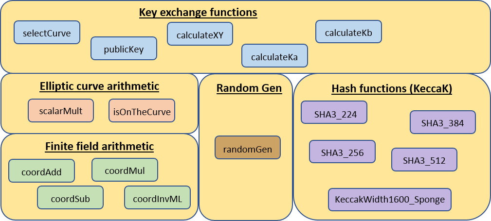

# Naxos Key Exchange

## Contents
1. [Project description](#project-description)
2. [Architecture](#architecture)
3. [Features](#features)
4. [How to run](#how-to-run)
5. [Basic usage](#basic-usage)
6. [Development notes](#development-notes)
7. [References](#references)
8. [License](#license)

# Project description

This project implements the Naxos authenticated key exchange (AKE) Protocol:
Stronger Security of Authenticated Key Exchange - Authors: Brian LaMacchia, Kristin Lauter and Anton Mityagin

The NAXOS AKE protocol uses a mathematical group G and two hash functions, H1: {0,1}* -> Zq
and H2: {0,1}* -> {0,1}λ (for some constant λ). A long-term secret key of a party A is an exponent
skA ~~C~~ Zq, and the corresponding long-term public key of A is the power pkA = gskA ~~C~~ G. 
In the following description of an AKE session of NAXOS executed between the parties A and B we
assume that each party knows the other’s public key and that public keys are in the group G. 
The session execution proceeds as follows. The parties pick ephemeral secret keys eskA and
eskB at random from {0,1}λ. Then the parties exchange values X=gH1(eskA,skA) and
Y=gH1(eskB,skB), check if received values are in the group G and only compute the session
keys if the check succeeds. 

Party A computes the session key Ka as:

H2(YskA, pkBH1(eskA,skA), YH1(eskA,skA), A, B),

and party B computes the session key Kb as:

H2(pkAH1(eskB,skB), XskB, H1(eskB,skB), A, B).

It can be easily checked that:

Ka = Kb = H2(gH1(eskB,skB)skA, gH1(eskA,skA)skB, gH1(eskA,skA)H1(eskB,skB), A, B).

The last two components in the hash are the identities of A and B, which we assume to be binary
strings.

# Architecture

# Features

In this implementation the group G is a finite cyclic subgroup of the NIST FIPS PUB 186-4 elliptic
curves over Prime Fields y2 = x3 - 3x + b (mod p) P-224, P-256, P-384, P-521.
The equivalent operation of exponentiation in the group G is a scalar multiplication of a number
in Zq by a point P on the curve.

H1 = H2 = SHA3 in order to generate keys of 224, 256, 384 and 512 bits respectively.

SHA3 functions are taken directly from the KeccaK Team official repository:
https://github.com/gvanas/KeccakCodePackage

The unix-like getrandom function is used for random number generation to get entropy from the
/dev/urandom device. 
It can be substituted by analogue functions in other OSs (for instance by BCryptGenRandom
in windows).

This package implements all the mathematical operations using internal representations of
the numbers in arrays of 64 bits words to be better suitable for x64 machines. 
It can be easily adapted to better perform on x86 by using arrays of 32 bits words.

The mathematical operations are not optimized for the specific NIST elliptic curves used.
They can work with any other elliptic curve over Prime fields.
The routines in this package can help to build a new curve for specific use.

Once selected the elliptic curve, all the algorithms in this package realize always the
same number of operations despite the input. Nevertheless, complete resistance to time attacks
is not guaranteed because some processors realize basic mathematical operations in different
time intervals according to the operands.
Furthermore, all temporary variables are cleared at each function exit.

## Integer and modular arithmetic
This package provides mathematical functions for Addition, Subtraction, Multiplication and
Inverse integer modulo p operations. 
Complementary functions for comparison and initialization of large integer numbers
are also provided. 
All the operations operate over integer numbers in internal representation format of arrays 
of 64 bits words.
All that functions are needed for the operations on the coordinates of the points on the elliptic curves.

## Elliptic curve arithmetic
The main function provided is the scalar multiplication of an integer modulo p with a point
P over the elliptic curve. 
It operates over integer numbers in internal representation format of arrays of 64 bits words. 
The points are represented by Affine coordinates (x,y), but all the internal operations
are for the algorithm are based on the Projective coordinates (X : Y : Z) where:

x = X/Z2 and y = Y/Z3

The implemented algorithm is a co-Z efficient version of the Montgomery ladder, and therefore all
the needed single operations for this algorithm are provided.

It is also provided a function to check that a point is on the curve.

## Hash functions
This package makes use of the SHA3 routines from the Keccak Team official repository:
https://github.com/gvanas/KeccakCodePackage

It has been used "make FIPS202-opt64.pack" to get a tarball with the sources needed
to compile the FIPS 202 functions generically optimized for 64-bit platforms.
The functions called directly by this code are:

* SHA3_224
* SHA3_256
* SHA3_384
* KeccakWidth1600_Sponge
* SHA3_512

They correspond to the following more generic ones in the standalone package in
https://github.com/gvanas/KeccakCodePackage/tree/master/Standalone/CompactFIPS202/C :

* FIPS202_SHA3_224
* FIPS202_SHA3_256
* FIPS202_SHA3_384
* Keccak
* FIPS202_SHA3_512

## Key exchange functions
All numbers in the key exchange functions are represented in arrays of chars.

* selectCurve: selects the NIST curve and the length of the key
* privateKey: calculates the private key pk from the secret key sk: pkA=g`*`skA and pkB=g`*`skB
* randomGen: generates random numbers based on unix-like /dev/urandom device (used in calculateXY)
* calculateXY: calculates X=g`*`H(eskA,skA) and Y=g`*`H(eskB,skB)
* calculateKa: calculates the key for user A Ka=H(Y`*`skA, pkB`*`H(eskA,skA), Y`*`H(eskA,skA), A, B)
* calculateKb: calculates the key for user B Kb=H(pkA`*`H(eskB,skB), X`*`skB, X`*`H(eskB,skB), A, B)

# How to run

## How to build it

Compile the code with any C compiler.

The tested code has been built with GCC.

## Example

Compile and run Example_Naxos.c to get an example on how to use the routines in this package.

In the example the hash of non-cryptographic rand() standard function is used to generate
the secret keys and the identities A and B.
In real life they are usually based on user/password schema.

Then it is simulated the key exchange according to the following steps:

1. A calculates the public key pkA.
2. A generate the ephemeral key and calculates X=g`*`H(eskA,skA)
3. A sends to B the identity IdA, pkA (in real life they are usually already note to B) and X.
The sending is simulated by a printout in the console.
4. B receives IdA, pkA and X.
5. B checks that pkA and X are on the curve, otherwise there is an error.
6. B calculates the public key pkB.
7. B generates the ephemeral key and calculates Y`*`H(eskA,skA), A, B)
8. B sends to A the identity IdB, pkB (in real life they are usually already note to A) and Y.
The sending is simulated by a printout in the console.
9. A checks that pkB and Y are on the curve, otherwise there is an error.
10. A calculates Ka=H(Y`*`skA, pkB`*`H(eskA,skA), Y`*`H(eskA,skA), IdA, IdB). If there is no error (the point is on the curve) it can star using it.
11. In the example Ka is printed in the console.
12. B calculates Kb=H(pkA`*`H(eskB,skB), X`*`skB, X`*`H(eskB,skB), IdA, IdB). If there is no error (the point is on the curve) it can star using it.
13. In the example Kb is printed in the console.

# Basic usage

Integrate the Naxos.h, Naxos.c and KeccaK subroutines in the application that needs the key exchange.

Call the functions privateKey, calculateXY, calculateKa and calculateKb to implement the key exchange.

# Development notes
Integers are represented internally with arrays of 64 bits. Therefore, integer and modular arithmetic
is more efficient with 64 bit OSs.

For a 32 bit OS it is recommended to use an internal representation of integer with arrays of 32 bits
and to modify coherently the arithmetic functions.

For the generation of the ephemeral keys it is made use of the unix-like getrandom
function to get entropy from the /dev/urandom device. 
It shall be substituted by analogue functions in other OSs (for instance by BCryptGenRandom
in windows).

The scalar multiplication of an integer modulo p with a point is calculated by means of a
co-Z efficient version of the Montgomery ladder algorithm which is not specialized for NIST
curves. 
Due to that, this implementation works fine with any new elliptic curve over a prime p of
224, 256, 385 or 521 bits which points satisfy the equation: y2 = x3 - 3x + b (mod p).

# References

1. Guide to Elliptic Curve Cryptography - Authors: Hankerson, Darrel, Menezes, Alfred J., Vanstone, Scott
2. Co-Z Addition Formulæ and Binary Ladders on Elliptic Curves - Authors: Raveen R. Goundar, Marc Joye, and Atsuko Miyaji
3. FIPS PUB 186-4, Digital Signature Standard (DSS)

# License

This project is of public domain and can be used by anybody under his responsibility.
